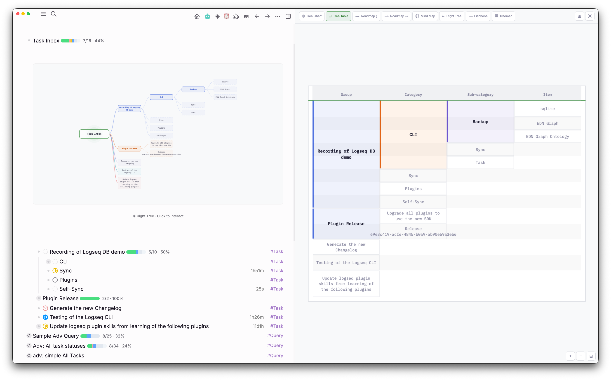

# OutlineCanvas

A Logseq plugin that transforms hierarchical block trees into interactive visual diagrams. One click turns any page or block into a polished diagram — no data export, no external tools required.

**Targets Logseq DB (SQLite) graphs only.**




## Features

### 8 Diagram Views

| View | Description |
|------|-------------|
| **Tree Chart** | Root top-left, branches flow right with bezier curves and colored background zones |
| **Tree Table** | Spanning-cell matrix with alternating row stripes and semantic column headers |
| **Roadmap ↕** | Horizontal timeline with phase cards alternating above/below the spine |
| **Roadmap →** | Linear timeline with all phase cards below the spine |
| **Mind Map** | Bilateral layout — branches split left/right from a central root |
| **Right Tree** | Classic left-to-right org chart with all branches stacked right |
| **Fishbone** | Ishikawa diagram with angled bones and sub-bone boxes |
| **Treemap** | Nested rectangles with content-aware cell sizing and hover breadcrumbs |

### Rendering

- **Canvas2D** with zero external rendering dependencies
- **Multi-line text wrapping** with adaptive node widths based on content length
- **Recursive depth rendering** — Tree Chart, Right Tree, and Mind Map render arbitrary depth levels as independent connected nodes
- **HiDPI** rendering via `devicePixelRatio` scaling
- **Pan/zoom** with pointer drag, scroll wheel, pinch-to-zoom, and keyboard controls

### Interaction

- **Click any node** to navigate to that block in the Logseq editor (and focus its relationships — see below)
- **View switching** with fade animation between all 8 views
- **Treemap breadcrumbs** — hover any cell to see its full hierarchy path
- **Fit-to-view** resets zoom to show the entire diagram

### Relationship Connectors

Visualize cross-hierarchy relationships between blocks using two user-created DB properties of type `:node`:

- **`relates_to`** — symmetric association (dashed gray line)
- **`depends_on`** — directional dependency (solid orange arrow)

Create the properties once on any block via Logseq's property UI, then assign other blocks as their values. OutlineCanvas surfaces them in **Tree Chart**, **Right Tree**, and **Mind Map** views with a lazy-edges UX:

- **At rest**: clean tree, no edges. Every node carrying refs shows small corner badges — `→N` outgoing (orange), `←N` incoming (gray).
- **Click a node**: the node gets an accent halo; its outgoing + incoming edges fade in. Click another node = focus switches. Click empty canvas = unfocus.
- **Stacked-column routing**: when source and target sit in the same column, the bezier arcs outward instead of slicing through intermediate boxes.
- **Optional labels**: enable **Label Relationship Connectors** in settings to show the property name (`depends_on` / `relates_to`) as a small pill at each curve's midpoint.

Connectors only draw between nodes already visible in the rendered subtree — external refs are dropped silently.

### Export

Two toolbar buttons capture the current view as a PNG (WYSIWYG — current pan/zoom, all edges visible regardless of focus):

- **⬇ Download** — saves `outline-canvas-<view>-<timestamp>.png` to your downloads folder
- **📋 Copy** — writes the image to your clipboard for pasting into any block or document

### Docked & Full-Screen Modes

- **Docked mode** (default): canvas opens alongside the right sidebar — your notes stay visible on the left
- **Full-screen mode**: canvas covers the entire viewport for maximum diagram space
- Toggle between modes with the toolbar button or `Cmd+Shift+O`

### Inline Macro Renderer

Embed static diagram images directly in your notes:

```
{{renderer :outline-canvas}}
{{renderer :outline-canvas, mind}}
{{renderer :outline-canvas, fish}}
```

Add child blocks beneath the macro block — they become the tree. Click the inline image to open the full interactive canvas.

### Theme Support

Automatically adapts to Logseq's light and dark themes. Switches live when you toggle the theme.

### Accessibility

- **Deuteranopia-safe** color palette — no red-green adjacency
- **Unique dash patterns** per branch color for color-blind users
- **WCAG 2.1 AA** contrast ratios (4.5:1 minimum) on all text; relationship connector overlays target the 3:1 graphical-element ratio
- **Keyboard navigation**: arrows to pan, +/- to zoom, 0 to fit, Esc to close

## Installation

### From source (development)

```bash
git clone https://github.com/hdansou/logseq-outline-canvas
cd logseq-outline-canvas
npm install
npm run dev
```

1. In Logseq, go to **Settings > Advanced** and enable **Developer mode**
2. Click **...** menu > **Plugins** > three-dot menu > **Load plugin from web url**
3. Enter `http://127.0.0.1:8080/` and click **Install**

### Production build

```bash
npm run build
```

Output goes to `dist/`.

## Usage

| Trigger | Action |
|---------|--------|
| Toolbar button (◈) | Open OutlineCanvas for the current page |
| `Cmd+Shift+O` | Open OutlineCanvas / toggle docked ↔ full-screen |
| `/outline` | Open OutlineCanvas focused on the current block |
| `/outline-canvas` | Insert inline macro renderer at cursor |

## Settings

| Setting | Default | Description |
|---------|---------|-------------|
| Default View | `tree` | Which diagram view to show on open |
| Maximum Depth | `3` | How many nesting levels to render |
| Depth Mode | `recursive` | `recursive`: independent nodes per level. `flat`: breadcrumb leaf labels |
| Show Empty Blocks | `false` | Include blocks with no title |
| Animate View Transitions | `true` | Fade animation when switching views |
| Show Relationship Connectors | `true` | Master toggle for `relates_to` / `depends_on` overlays (edges, badges, halo, labels) |
| Label Relationship Connectors | `false` | Show the property name as a small pill at the midpoint of each visible connector |

## Tech Stack

| Layer | Technology |
|-------|-----------|
| Plugin SDK | `@logseq/libs` |
| Build | Vite + `vite-plugin-logseq` |
| Language | TypeScript (strict) |
| Rendering | Canvas2D (zero dependencies) |
| Font | IBM Plex Mono (Google Fonts CDN) |

## License

MIT
